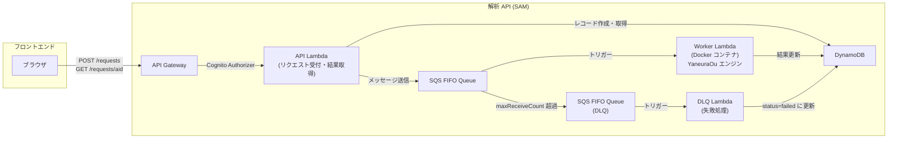
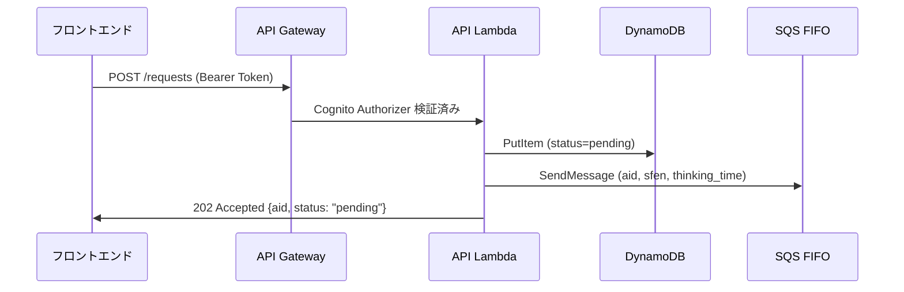
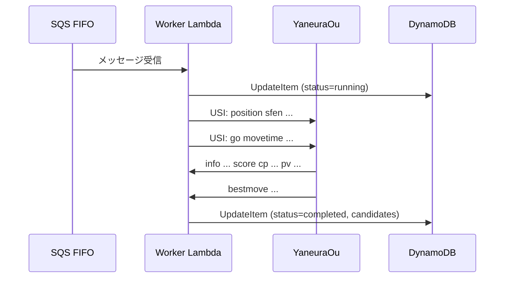
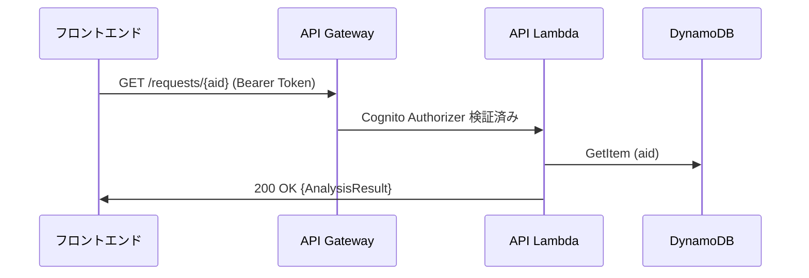
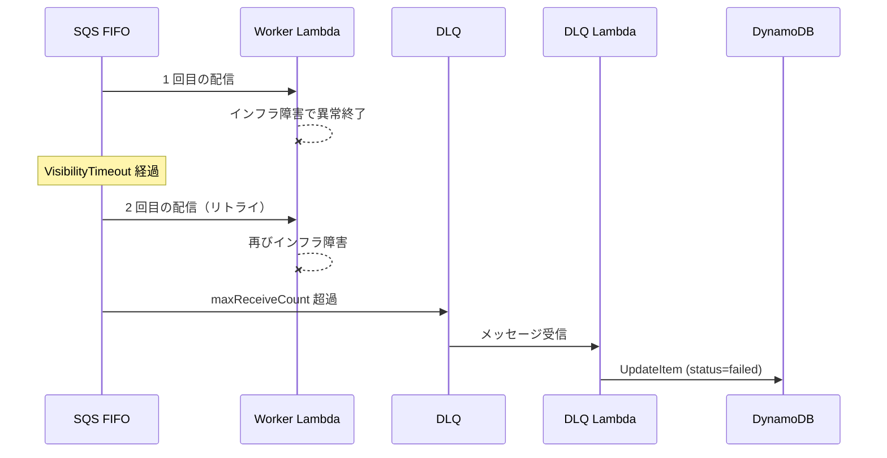

# アーキテクチャ設計

## 概要

解析 API は将棋の局面解析を非同期で処理するマイクロサービスである。フロントエンドからのリクエストを受け付け、YaneuraOu 将棋エンジンで局面を解析し、結果を返却する。

### サービス基本情報

| 項目 | 値 |
|------|-----|
| サービス名 | `backend-analysis` |
| ベースパス | `/api/v1/analysis` |
| API 仕様 | [openapi_analysis.yaml](../../../docs/openapi_analysis.yaml) |
| 責務定義 | [units_definition.md](../../../docs/units_definition.md) |

---

## 全体構成図

---

## Lambda 関数構成

解析 API は 3 つの Lambda 関数で構成される。[technical_policies.md](../../../docs/technical_policies.md) の Lambdalith 原則に対し、本サービスでは要件に応じて複数 Lambda を採用する。

| Lambda | 役割 | ランタイム | トリガー |
|--------|------|----------|---------|
| API Lambda | REST API のリクエスト処理（受付・結果取得） | Python 3.13（zip） | API Gateway |
| Worker Lambda | YaneuraOu エンジンによる局面解析の実行 | Python 3.13（Docker コンテナ） | SQS FIFO |
| DLQ Lambda | インフラ障害で処理できなかったメッセージの失敗処理 | Python 3.13（zip） | SQS FIFO (DLQ) |

### API Lambda と Worker Lambda を分離する理由

1. **コンテナイメージサイズ**: Worker Lambda は YaneuraOu エンジン（C++ バイナリ + NNUE 評価関数）を含む Docker イメージが必要。API Lambda にこの依存を含めると不要なコールドスタート遅延が発生する
2. **リソース要件の違い**: Worker Lambda はエンジン実行のために大きなメモリ（2048 MB）とタイムアウト（30 秒）が必要。API Lambda は軽量な DB 操作のみで低メモリ・短タイムアウトで十分
3. **スケーリング特性**: API Lambda は同期レスポンスのため高並行性が必要。Worker Lambda は計算集約的なため並行数を制限する必要がある

---

## 非同期処理のデータフロー

### 解析リクエスト作成（POST /requests）

1. フロントエンドが解析リクエストを送信する
2. API Gateway が Cognito Authorizer でアクセストークンを検証する
3. API Lambda が DynamoDB に `status=pending` のレコードを作成する
4. API Lambda が SQS FIFO キューにメッセージを送信する
5. フロントエンドに `202 Accepted` と解析 ID を返却する

### 解析実行（Worker Lambda）

1. SQS がメッセージを Worker Lambda に配信する
2. Worker Lambda が DynamoDB のステータスを `running` に更新する
3. Worker Lambda が YaneuraOu エンジンを起動し、USI プロトコルで局面解析を実行する
4. エンジンの出力（評価値・読み筋）をパースする
5. DynamoDB のレコードを `completed` と解析結果で更新する

### 解析結果取得（GET /requests/{aid}）

フロントエンドはポーリングで解析の進捗を確認する。`status` が `completed` または `failed` になるまで定期的にリクエストを送る。

---

## エラーハンドリング

### アプリケーションエラー（Worker Lambda で捕捉可能）

エンジン起動失敗、エンジンタイムアウト、パースエラー等の場合:

1. Worker Lambda が try-except でエラーを捕捉する
2. DynamoDB のステータスを `failed` に更新し、`error_message` にエラー内容を記録する
3. handler が正常終了する → SQS メッセージは削除される

### インフラ障害（Worker Lambda で捕捉不可能）

OOMKill、コンテナクラッシュ、Lambda タイムアウト等の場合:

1. Worker Lambda が異常終了する → SQS メッセージは削除されない
2. VisibilityTimeout 経過後、SQS が再配信を試みる
3. maxReceiveCount（2 回）を超えるとメッセージが DLQ に移動する
4. DLQ Lambda がトリガーされ、DynamoDB のステータスを `failed` に更新する

---

## 認証

[units_definition.md](../../../docs/units_definition.md) に基づき、解析 API はメイン API のリソースを参照しない。ユーザー情報は Cognito の Access Token から取得する。

| 項目 | 仕様 |
|------|------|
| 認証方式 | API Gateway Cognito Authorizer |
| ユーザー識別 | `cognito:username` クレーム |
| Cognito 情報の取得元 | インフラスタックの CloudFormation エクスポート |

---

## リソース一覧

| リソース | 用途 |
|---------|------|
| API Gateway (REST API) | REST API エンドポイント |
| API Lambda | リクエスト受付・結果取得 |
| Worker Lambda (Docker) | YaneuraOu エンジンによる解析実行 |
| DLQ Lambda | インフラ障害時の失敗処理 |
| SQS FIFO Queue | 非同期処理の委譲 |
| SQS FIFO Queue (DLQ) | Worker Lambda が処理できなかったメッセージの退避 |
| DynamoDB Table | 解析リクエスト・結果の保持 |
