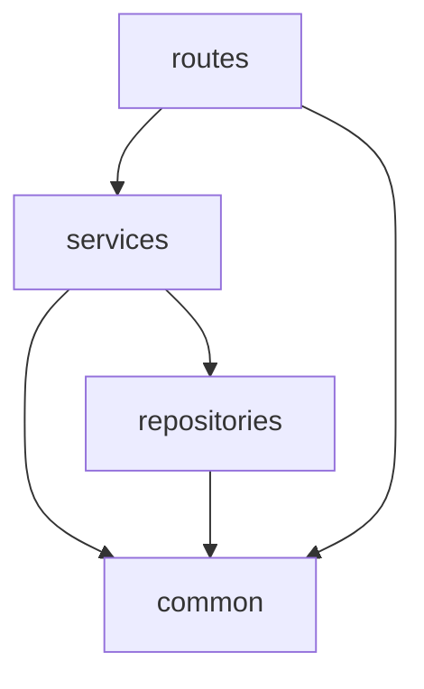

# ディレクトリ構成

## 概要

解析 API は 3 つの Lambda 関数（API Lambda + Worker Lambda + DLQ Lambda）で構成される。API Lambda は Lambdalith 構成で REST API を処理し、Worker Lambda は Docker コンテナ上で YaneuraOu エンジンを実行する。DLQ Lambda はインフラ障害で処理できなかったメッセージの失敗処理を行う。

---

## ディレクトリツリー

```
Backend/analysis/
├── template.yaml                # SAM テンプレート
├── requirements.txt             # API Lambda 本番依存パッケージ
├── requirements-dev.txt         # 開発用依存パッケージ
├── pytest.ini                   # pytest 設定
├── api/
│   ├── app.py                   # API Lambda エントリポイント
│   ├── routes/
│   │   ├── __init__.py
│   │   └── analysis.py          # /requests/* ルート定義
│   ├── services/
│   │   ├── __init__.py
│   │   └── analysis_service.py  # 解析ビジネスロジック
│   ├── repositories/
│   │   ├── __init__.py
│   │   ├── dynamodb.py          # DynamoDB 接続初期化
│   │   └── analysis_repository.py # DynamoDB CRUD 操作
│   └── common/
│       ├── __init__.py
│       ├── auth.py              # Cognito username 取得
│       ├── config.py            # 環境変数管理
│       ├── exceptions.py        # カスタム例外クラス
│       └── id_generator.py      # 解析 ID 生成
├── worker/
│   ├── Dockerfile               # Worker Lambda コンテナ定義
│   ├── handler.py               # Worker Lambda エントリポイント
│   └── engine.py                # YaneuraOu エンジン通信
├── dlq/
│   └── handler.py               # DLQ Lambda エントリポイント
└── tests/
    ├── __init__.py
    ├── conftest.py              # 共通フィクスチャ
    ├── test_routes.py           # ルート層統合テスト
    ├── test_services.py         # サービス層単体テスト
    ├── test_repositories.py     # リポジトリ層単体テスト
    └── test_engine.py           # エンジン通信テスト
```

---

## API Lambda のレイヤー構成

API Lambda は 3 レイヤー + 共通モジュールで構成する。



### routes 層

HTTP リクエストの受付とレスポンスの返却を担当する。

- AWS Lambda Powertools の `Router` を使用
- リクエストボディの JSON パース、パスパラメータの取得
- サービス層の呼び出し
- ステータスコードの制御
- **ビジネスロジックを含めない**

### services 層

ビジネスロジックの実装を担当する。

- 入力バリデーション（SFEN 形式、thinking_time の値）
- 解析 ID の生成
- DynamoDB へのレコード作成（リポジトリ経由）
- SQS へのメッセージ送信
- レスポンス用データの組み立て

### repositories 層

DynamoDB への CRUD 操作を担当する。

- boto3 の DynamoDB リソースを使用
- PutItem, GetItem, UpdateItem 操作のカプセル化
- **ビジネスロジックを含めない**

### common 層

横断的関心事を担当する。全レイヤーから参照可能。

- 認証情報の取得
- 環境変数管理
- 例外クラス定義
- ID 生成ユーティリティ

---

## Worker Lambda のファイル構成

Worker Lambda は Docker コンテナとして構築される。レイヤー分割は行わず、シンプルな構成とする。

| ファイル | 責務 |
|---------|------|
| `Dockerfile` | Lambda コンテナイメージの定義。YaneuraOu のコンパイル・配置を含む |
| `handler.py` | SQS イベントの処理。メッセージのパース、エンジン呼び出し、DynamoDB 更新 |
| `engine.py` | YaneuraOu エンジンとの USI プロトコル通信。プロセス管理、コマンド送受信、結果パース |

---

## DLQ Lambda のファイル構成

DLQ Lambda は Worker Lambda がインフラ障害で処理できなかったメッセージを受け取り、DynamoDB のステータスを `failed` に更新する。単一ファイルで構成する。

| ファイル | 責務 |
|---------|------|
| `handler.py` | DLQ メッセージからパラメータを取得し、DynamoDB の該当レコードを `status=failed` に更新する |

---

## 依存関係ルール

- API Lambda、Worker Lambda、DLQ Lambda は独立したデプロイ単位である
- Lambda 間でモジュールを import しない
- 各 Lambda は DynamoDB と SQS を介して間接的に連携する

---

## 各ファイルの責務

### API Lambda

| ファイル | 責務 |
|---------|------|
| `app.py` | `APIGatewayRestResolver` の初期化、Router の include、例外ハンドラの登録、`lambda_handler` 関数の定義 |
| `routes/analysis.py` | `POST /requests`、`GET /requests/{aid}` のルート定義 |
| `services/analysis_service.py` | 解析リクエストの作成（バリデーション、ID 生成、DynamoDB 書き込み、SQS 送信）、解析結果の取得 |
| `repositories/dynamodb.py` | DynamoDB テーブルリソースの初期化 |
| `repositories/analysis_repository.py` | analyses テーブルの PutItem、GetItem、UpdateItem 操作 |
| `common/auth.py` | `get_username(app)` — Cognito authorizer から username 取得 |
| `common/config.py` | 環境変数の読み込み（`DYNAMODB_TABLE_NAME`、`SQS_QUEUE_URL`） |
| `common/exceptions.py` | `AppError`、`NotFoundError`、`ValidationError` |
| `common/id_generator.py` | 解析 ID（`aid`）の生成 |

### Worker Lambda

| ファイル | 責務 |
|---------|------|
| `handler.py` | SQS イベントからメッセージを取得し、エンジンで解析を実行し、DynamoDB に結果を書き込む。アプリケーションエラーは try-except で捕捉し `failed` に更新する |
| `engine.py` | YaneuraOu エンジンプロセスの起動・終了、USI コマンドの送受信、解析結果のパース |

### DLQ Lambda

| ファイル | 責務 |
|---------|------|
| `handler.py` | DLQ メッセージを受け取り、DynamoDB の該当レコードを `status=failed`、`error_message` を設定して更新する |

---

## 依存パッケージ

### `requirements.txt`（API Lambda 本番）

```
aws-lambda-powertools
boto3
```

### `requirements-dev.txt`（開発）

```
-r requirements.txt
pytest
moto[dynamodb,sqs]
```

> Worker Lambda の依存パッケージは Dockerfile 内で管理する。Worker Lambda は boto3 のみを使用し、Lambda ベースイメージにプリインストールされている。
