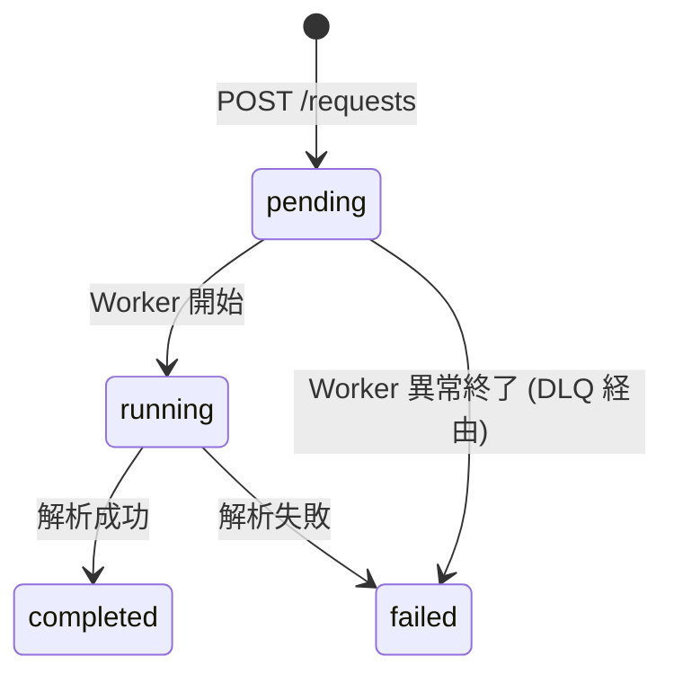

# DynamoDB テーブル設計

## 概要

解析 API のデータストアとして DynamoDB を採用する。解析リクエストのステータス管理と結果の保持を行う。

### テーブル基本情報

| 項目 | 値 |
|------|-----|
| テーブル名 | `dynamodb-sgp-${env}-backend-analysis` |
| 課金モード | PAY_PER_REQUEST（オンデマンド） |
| パーティションキー | `pk` (String) |
| ソートキー | `sk` (String) |

---

## キー設計

単一テーブルに解析リクエストを格納する。将来の拡張（ユーザー別リスト取得等）に対応できるよう、複合キー設計を採用する。

| pk | sk | 用途 |
|-----|-----|------|
| `USER#{username}` | `AID#{aid}` | 解析リクエストレコード |

---

## 属性定義

| 属性名 | 型 | 説明 |
|--------|-----|------|
| `pk` | String | パーティションキー |
| `sk` | String | ソートキー |
| `aid` | String | 解析リクエスト ID（12 文字の英数字） |
| `username` | String | Cognito ユーザー名 |
| `status` | String | 解析ステータス（`pending` / `running` / `completed` / `failed`） |
| `sfen` | String | 解析対象の局面（SFEN 形式） |
| `thinking_time` | Number | 思考時間（ミリ秒: 3000 / 5000 / 10000） |
| `candidates` | List | 候補手リスト（`status=completed` の場合のみ） |
| `error_message` | String | エラーメッセージ（`status=failed` の場合のみ） |
| `created_at` | String | リクエスト日時（ISO 8601 UTC） |
| `ttl` | Number | TTL（エポック秒）。レコードの自動削除に使用 |

### candidates の構造

```json
[
  {"rank": 1, "score": 450, "pv": "7g7f 8c8d 2g2f"},
  {"rank": 2, "score": 420, "pv": "2g2f 8c8d 7g7f"},
  {"rank": 3, "score": 380, "pv": "5i6h 8c8d 7g7f"}
]
```

---

## アクセスパターン

| # | パターン | 呼び出し元 | オペレーション | キー条件 |
|---|---------|-----------|-------------|---------|
| 1 | 解析リクエスト作成 | API Lambda | PutItem | `pk=USER#{username}`, `sk=AID#{aid}` |
| 2 | 解析結果取得 | API Lambda | GetItem | `pk=USER#{username}`, `sk=AID#{aid}` |
| 3 | ステータス更新 (running) | Worker Lambda | UpdateItem | `pk=USER#{username}`, `sk=AID#{aid}` |
| 4 | 結果更新 (completed) | Worker Lambda | UpdateItem | `pk=USER#{username}`, `sk=AID#{aid}` |
| 5 | エラー更新 (failed) | Worker Lambda | UpdateItem | `pk=USER#{username}`, `sk=AID#{aid}` |

### パターン 1: 解析リクエスト作成

```python
table.put_item(Item={
    "pk": f"USER#{username}",
    "sk": f"AID#{aid}",
    "aid": aid,
    "username": username,
    "status": "pending",
    "sfen": sfen,
    "thinking_time": thinking_time,
    "created_at": now_iso8601(),
    "ttl": int(time.time()) + 86400,  # 24 時間後に自動削除
})
```

### パターン 2: 解析結果取得

```python
response = table.get_item(Key={
    "pk": f"USER#{username}",
    "sk": f"AID#{aid}",
})
item = response.get("Item")
```

> `username` をキーに含めることで、他ユーザーの解析結果にアクセスできないことを保証する。

### パターン 4: 結果更新 (completed)

```python
table.update_item(
    Key={"pk": f"USER#{username}", "sk": f"AID#{aid}"},
    UpdateExpression="SET #status = :st, candidates = :ca",
    ExpressionAttributeNames={"#status": "status"},
    ExpressionAttributeValues={
        ":st": "completed",
        ":ca": candidates,
    },
)
```

---

## データライフサイクル

### TTL による自動削除

解析結果は一時的なデータであり、長期保存は不要である。DynamoDB の TTL 機能を使用して、レコードを自動削除する。

| 項目 | 値 |
|------|-----|
| TTL 属性名 | `ttl` |
| 保持期間 | 24 時間 |

> TTL による削除はバックグラウンドで非同期に行われるため、即時削除ではない。通常 48 時間以内に削除される。

### ステータス遷移



---

## Worker Lambda からの DynamoDB アクセス

Worker Lambda は SQS メッセージから `username` と `aid` を受け取り、DynamoDB のキーを構築する。

### SQS メッセージ本文

```json
{
  "username": "user123",
  "aid": "abc123def456",
  "sfen": "lnsgkgsnl/1r5b1/ppppppppp/9/9/9/PPPPPPPPP/1B5R1/LNSGKGSNL b - 1",
  "thinking_time": 3000
}
```
