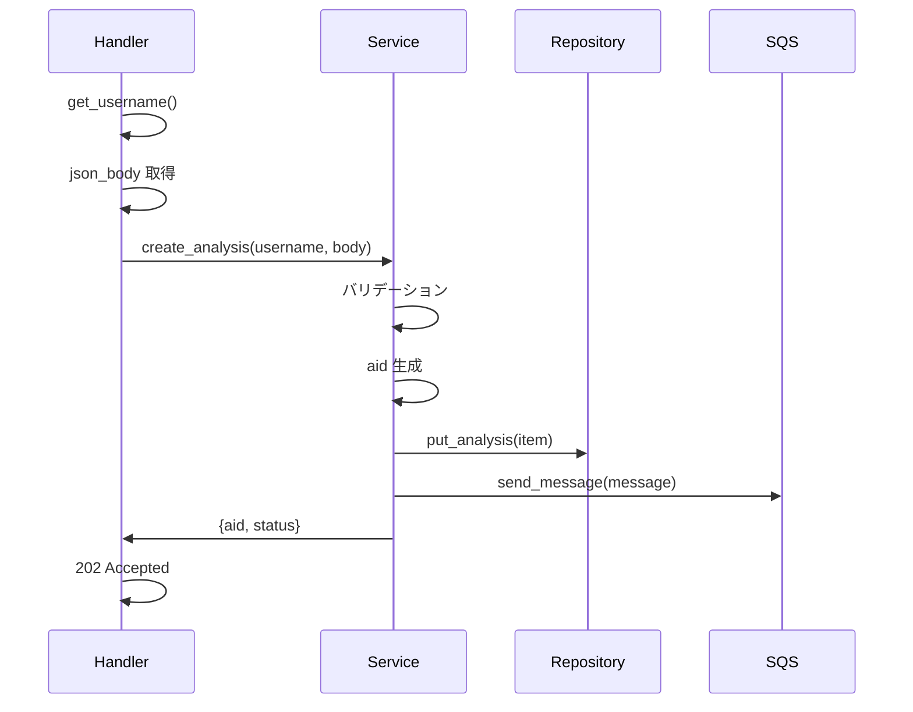
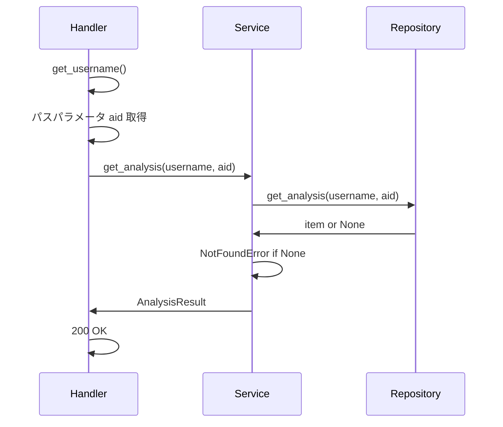

# API 設計

## 概要

API Lambda は AWS Lambda Powertools for Python の `APIGatewayRestResolver` をエントリポイントとして使用する。API 仕様は [openapi_analysis.yaml](../../../docs/openapi_analysis.yaml) に準拠する。

API Gateway のステージパス `/api/v1/analysis` は `strip_prefixes` で除去し、Lambda 内のルート定義はプレフィックスなしで記述する。

---

## app.py のエントリポイント設計

```python
app = APIGatewayRestResolver(
    strip_prefixes=["/api/v1/analysis"],
    cors=CORSConfig(
        allow_origin="*",
        allow_headers=["Content-Type", "Authorization"],
        allow_methods=["GET", "POST", "OPTIONS"],
        allow_credentials=False,
    ),
)
```

### Router の include

```python
app.include_router(analysis_router, prefix="/requests")
```

### 例外ハンドラの登録

```python
@app.exception_handler(AppError)
def handle_app_error(ex: AppError):
    return Response(
        status_code=ex.status_code,
        content_type="application/json",
        body=json.dumps({"message": ex.message}),
    )

@app.exception_handler(Exception)
def handle_unexpected_error(ex: Exception):
    logger.exception("Unexpected error")
    return Response(
        status_code=500,
        content_type="application/json",
        body=json.dumps({"message": "Internal server error"}),
    )
```

### lambda_handler

```python
def lambda_handler(event, context):
    return app.resolve(event, context)
```

---

## ルーティング一覧

### analysis.py

| メソッド | Router 内パス | ハンドラ関数 | 認証 | HTTP ステータス |
|---------|-------------|------------|------|---------------|
| POST | `/` | `create_analysis` | 要 | 202 |
| GET | `/<aid>` | `get_analysis` | 要 | 200 |

---

## 認証の扱い

### API Gateway レベル

- Cognito Authorizer を全エンドポイントにデフォルトで適用する
- 認証に失敗したリクエストは API Gateway が 401 を返し、Lambda には到達しない

### Lambda レベル

- `common/auth.py` の `get_username(app)` で `cognito:username` を取得する
- ユーザー名は DynamoDB のキー（`pk=USER#{username}`）に使用し、他ユーザーの解析結果へのアクセスを防止する

---

## 各ハンドラの処理フロー

### `create_analysis` — 解析リクエストの作成



1. `get_username()` で username を取得
2. リクエストボディを取得
3. `analysis_service.create_analysis(username, body)` を呼び出し:
   - `sfen` の存在チェック
   - `thinking_time` のバリデーション（3000, 5000, 10000 のいずれか）
   - `aid` を生成（12 文字の英数字）
   - DynamoDB に `status=pending` のレコードを PutItem
   - SQS FIFO キューにメッセージを送信
     - `MessageBody`: `{"username", "aid", "sfen", "thinking_time"}`
     - `MessageGroupId`: `username`（ユーザー単位での順序保証）
     - `MessageDeduplicationId`: `aid`（重複防止）
4. `202 Accepted` で `{aid, status: "pending"}` を返却

### `get_analysis` — 解析ステータス・結果の取得



1. `get_username()` で username を取得
2. パスパラメータ `aid` を取得
3. `analysis_service.get_analysis(username, aid)` を呼び出し:
   - DynamoDB から `pk=USER#{username}`, `sk=AID#{aid}` で GetItem
   - 見つからない場合は `NotFoundError`
   - `AnalysisResult` レスポンスを組み立て
4. `200 OK` で返却

---

## バリデーション

バリデーションはサービス層で実施する。

| 対象 | ルール | 例外 |
|------|-------|------|
| `sfen` | 必須（空文字列でないこと） | `ValidationError` |
| `thinking_time` | 必須。`3000`, `5000`, `10000` のいずれか | `ValidationError` |

---

## レスポンス形式

### 202 Accepted（解析リクエスト作成）

```json
{
  "aid": "abc123def456",
  "status": "pending"
}
```

### 200 OK（解析結果取得 — pending/running）

```json
{
  "aid": "abc123def456",
  "status": "running",
  "sfen": "lnsgkgsnl/1r5b1/ppppppppp/9/9/9/PPPPPPPPP/1B5R1/LNSGKGSNL b - 1",
  "thinking_time": 3000,
  "created_at": "2025-01-15T09:30:00Z"
}
```

### 200 OK（解析結果取得 — completed）

```json
{
  "aid": "abc123def456",
  "status": "completed",
  "sfen": "lnsgkgsnl/1r5b1/ppppppppp/9/9/9/PPPPPPPPP/1B5R1/LNSGKGSNL b - 1",
  "thinking_time": 3000,
  "candidates": [
    {"rank": 1, "score": 450, "pv": "7g7f 8c8d 2g2f"},
    {"rank": 2, "score": 420, "pv": "2g2f 8c8d 7g7f"},
    {"rank": 3, "score": 380, "pv": "5i6h 8c8d 7g7f"}
  ],
  "created_at": "2025-01-15T09:30:00Z"
}
```

### 200 OK（解析結果取得 — failed）

```json
{
  "aid": "abc123def456",
  "status": "failed",
  "sfen": "lnsgkgsnl/1r5b1/ppppppppp/9/9/9/PPPPPPPPP/1B5R1/LNSGKGSNL b - 1",
  "thinking_time": 3000,
  "error_message": "Engine process timed out",
  "created_at": "2025-01-15T09:30:00Z"
}
```

### エラーレスポンス

全エラーレスポンスは [openapi_analysis.yaml](../../../docs/openapi_analysis.yaml) の `Error` スキーマに準拠する。

```json
{
  "message": "エラーメッセージ"
}
```
